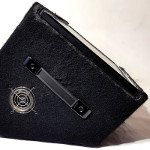

Der Songprompter ist ein bühnentaugliches Gerät, das Musikern Texte, Akkorde und andere Informationen anzeigt.

# Das Gerät

[Bilder](/images)

# Songtexte schreiben

[Howto](/howto)

# Kontakt

[Impressum und Kontakt](https://danielfett.de/de/ueber-mich/)
